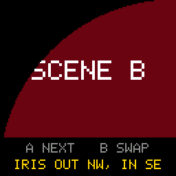

# Scene Transitions

> **Demonstration project** — provided as an example of what the PixelRoot32
> Game Engine can do. It is not a product: parts may be incomplete,
> experimental, or deliberately simplified to keep one idea in focus.

Two scenes, each a solid colour with its name on it, and a button that swaps
one for the other. Another button walks a catalogue of seven transitions: a
fade, an iris from the centre, an iris that closes on one corner and opens from
the opposite one, and a diagonal wipe in each of its four directions. Its one
idea is where a transition lives: **a transition is a full-screen post-effect
applied during a scene swap. It does not belong to either scene, and the scenes
do not have to know it exists.**

Language: C++17  
Engine: `gperez88/PixelRoot32-Game-Engine@^1.9.0`  
Environments: `native`, `esp32dev`  
Category: Graphics  



## Requirements (build flags)

Set in [`lib/platformio.ini`](lib/platformio.ini) (`base` template, inherited by
every environment).

| Flag | Set to | Why |
|------|--------|-----|
| `PIXELROOT32_ENABLE_SCENE_TRANSITIONS` | `1` | The topic. The engine default is already `1` (`include/platforms/PlatformDefaults.h`), so the line is there to state the dependency, not to change the build. |
| `PIXELROOT32_ENABLE_AUDIO` | `0` | Off on purpose. Frees roughly **17 KB** of RAM: mixer voices, the SPSC command queue, and the sequencer state. This demo makes no sound. |
| `PIXELROOT32_ENABLE_PHYSICS` | `0` | Off on purpose. Frees roughly **9 KB**: `CollisionSystem`'s actor tables and the fixed-timestep `PhysicsScheduler`, both members of every `Scene`. There are no actors here. |
| `PIXELROOT32_ENABLE_UI_SYSTEM` | `0` | Off on purpose. Frees roughly **9 KB**: `UIManager`'s widget and hit-test tables, again a per-`Scene` member. The HUD is three `Renderer::drawTextCentered` calls. |
| `PIXELROOT32_ENABLE_PARTICLES` | `0` | Off on purpose. Frees roughly **2 KB** of particle pool. |

**Building with `PIXELROOT32_ENABLE_SCENE_TRANSITIONS=0` is not an error.**
`TransitionEffect.h` swaps the real class for a stub whose `isActive()` always
returns `false`. `SceneManager` still runs its Out → swap → In sequence, but
each phase ends on its first tick, so every swap is an instant cut. The HUD
still cycles through all seven names; none of them does anything.

## Platforms

| Environment | Display | Audio backend |
|-------------|---------|---------------|
| **`native`** | SDL2, 128×128 logical size | none — `PIXELROOT32_ENABLE_AUDIO=0` |
| **`esp32dev`** | **ST7735** 128×128 (GreenTab3 profile), SPI pins in [`platformio.ini`](platformio.ini): MOSI **23**, SCLK **18**, DC **2**, RST **4**, CS **-1** | none — `PIXELROOT32_ENABLE_AUDIO=0` |

## Controls

| Button | `native` | `esp32dev` | Action |
|--------|----------|------------|--------|
| **A** | `Space` | GPIO **13** | Select the next transition. The yellow line in the HUD names it. |
| **B** | `Enter` | GPIO **12** | Swap to the other scene with the selected transition. |

Both buttons are ignored while a swap is on screen: `SceneManager` does not call
`Scene::update()` during a transition, so the scenes never see the presses.

## What it demonstrates

### The scenes do not know

[`ColourScene`](src/ColourScene.cpp) paints a colour, a name and a HUD. It does
not include `TransitionEffect.h`, has no timer, and draws nothing differently
while a transition runs. Both scenes are instances of that one class.

Everything about transitions sits in
[`TransitionSelector.cpp`](src/TransitionSelector.cpp): a `constexpr` catalogue
and the index of the current entry. When **B** is pressed, the scene calls
`selector::swapTo(other)`, and the selector calls `Engine::triggerTransition()`.
From then on the engine owns the transition:

1. **Out.** The old scene keeps drawing, and the effect darkens more of each
   finished frame until the screen is black.
2. **Swap.** On one tick `SceneManager` replaces the scene and calls `init()`
   on the new one.
3. **In.** The new scene draws, and the effect reveals it.

The effect runs inside `Engine::draw()`, after `SceneManager::draw()` has drawn
the scene and before the frame is presented. It rewrites pixels that are already
in the framebuffer, so it works the same over any scene, whatever that scene
draws.

### The selection has to live outside both scenes

Step 2 calls `init()` on the scene it lands on. Anything a scene stores about
"which transition comes next" is at risk on every swap, and the two scenes would
have to copy it back and forth. The index is a file-scope variable in
`TransitionSelector.cpp` instead. Both scenes read it through `currentName()`,
neither owns it, and a swap cannot reset it. After a swap, the HUD on the new
scene shows the entry you picked on the old one.

### The catalogue, and the two `triggerTransition` overloads

| HUD name | Type | Call |
|----------|------|------|
| `FADE` | `Fade` | `triggerTransition(&scene, Fade, 500)` |
| `IRIS CENTRE` | `Iris` | `triggerTransition(&scene, Iris, 500)` |
| `IRIS OUT NW, IN SE` | `Iris` | `triggerTransition(&scene, Iris, 500, 0, 0, 127, 127)` |
| `WIPE NW-SE` … `WIPE SW-NE` | `DiagonalWipe` | `setWipeDirection(dir)`, then `triggerTransition(&scene, DiagonalWipe, 500)` |

`500` is the length of **each** phase, so a full swap takes about one second.

The iris centre is a pair of points, not one. With the seven-argument overload,
the iris closes on the top-left corner while the old scene is on screen and
opens from the bottom-right corner on the new one. The engine scales the radius
to the corner furthest from each centre, so a corner iris still covers the
whole screen. With the three-argument overload both centres are reset to `-1`,
which means the middle of the buffer.

### `TransitionEngine`: a workaround for the wipe direction

Engine 1.9.0 has no public way to choose a `WipeDirection`. `triggerTransition()`
has no parameter for it, and the `TransitionEffect` that `SceneManager` drives is
`Engine::transitionEffect_`, a **protected** member. So the platform headers
instantiate [`TransitionEngine`](src/TransitionEngine.h) instead of `Engine`. It
inherits every constructor and adds one method:

```cpp
void setWipeDirection(WipeDirection direction) {
    transitionEffect_.setWipeDirection(direction);
}
```

This subclass exists only because of that API gap, and it reaches a protected
member. It is not a pattern to copy for anything else. If a later engine release
accepts a direction in `triggerTransition()`, delete the class and go back to
`pixelroot32::core::Engine`.

It works because of an implementation detail. `SceneManager` calls
`TransitionEffect::init()` twice per swap, once for Out and once for In.
`init()` resets the timer and the iris centres, but not the wipe direction. So
a direction set before `triggerTransition()` holds for both phases. The wipe
moves from its first corner towards the opposite one in both phases: first it
hides the old scene, then it reveals the new one.

### Which buffer the effect runs on (the engine decides, not the demo)

Nothing in this demo is platform-specific. `Engine::draw()` asks the draw
surface for a buffer and picks the code path from the answer:

```cpp
uint8_t* buffer8 = drawSurface.getSpriteBuffer();
if (buffer8 != nullptr) {
    transitionEffect_.apply(buffer8, w, h);            // 8bpp
} else {
    uint16_t* bufferRGB565 = drawSurface.getPixelBuffer();
    if (bufferRGB565 != nullptr) {
        transitionEffect_.applyRGB565(bufferRGB565, w, h);
    }
}
```

| Environment | Driver | `getSpriteBuffer()` | `getPixelBuffer()` | Path |
|-------------|--------|---------------------|--------------------|------|
| `esp32dev` | `TFT_eSPI_Drawer` | the 8-bit `TFT_eSprite` it renders into | not overridden (`nullptr`) | `apply()` |
| `native` | `SDL2_Drawer` | `nullptr` | its RGB565 pixel array | `applyRGB565()` |

The two paths do not produce identical results:

- **Iris and wipe** set pixels to `0` on both paths, which is black in both
  formats. They look the same everywhere.
- **Fade** scales each colour channel on both paths, but the channels have
  different depths. In the 8-bit sprite, a colour is RGB332: 8 levels of red,
  8 of green, 4 of blue. RGB565 has 32, 64 and 32. The same fade therefore has
  far fewer intermediate colours on the board than on the simulator. If a fade
  looks smooth on `native` and banded on the ST7735, that difference is the
  first thing to check.

A driver that returns `nullptr` from both methods gets the timing and the input
lock-out of a transition, but no visible effect.

### Zero allocation

The catalogue is a `constexpr` array of plain structs, the names are string
literals, and the effect itself has only fixed-size members. No code in
`update()` or `draw()` allocates, on either side of the engine boundary.

## Build

From **`graphics/scene_transitions`**:

```bash
pio run -e native
pio run -e native --target exec
pio run -e esp32dev
```

The committed `[env:native]` flags target Windows/MSYS2. On Linux drop the
`-IC:/msys64/...`, `-LC:/msys64/...` and `-mconsole` lines; on macOS drop them
and uncomment the two Homebrew lines above them. CI does this itself.

## Upload (ESP32)

```bash
pio run -e esp32dev --target upload
```

## Engine documentation

- [Core API](https://github.com/PixelRoot32-Game-Engine/PixelRoot32-Game-Engine/blob/main/docs/api/core.md)
- [Scene manager](https://github.com/PixelRoot32-Game-Engine/PixelRoot32-Game-Engine/blob/main/docs/scene-manager.md)
- [`core/Engine.h`](https://github.com/PixelRoot32-Game-Engine/PixelRoot32-Game-Engine/blob/main/include/core/Engine.h): both `triggerTransition` overloads
- [`graphics/TransitionEffect.h`](https://github.com/PixelRoot32-Game-Engine/PixelRoot32-Game-Engine/blob/main/include/graphics/TransitionEffect.h): `TransitionType`, `WipeDirection`, and the disabled-flag stub

## License

Source code: [MIT](../../LICENSE).

This demo ships no art, audio, or generated asset headers. Both scenes are
`Renderer` rectangles and text in the engine's built-in 5×7 font, drawn against
the built-in PR32 palette, so there is nothing here to attribute.
